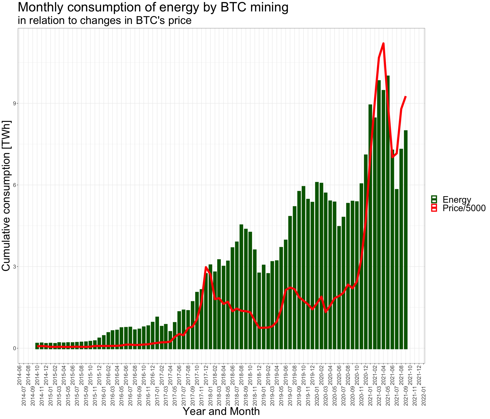
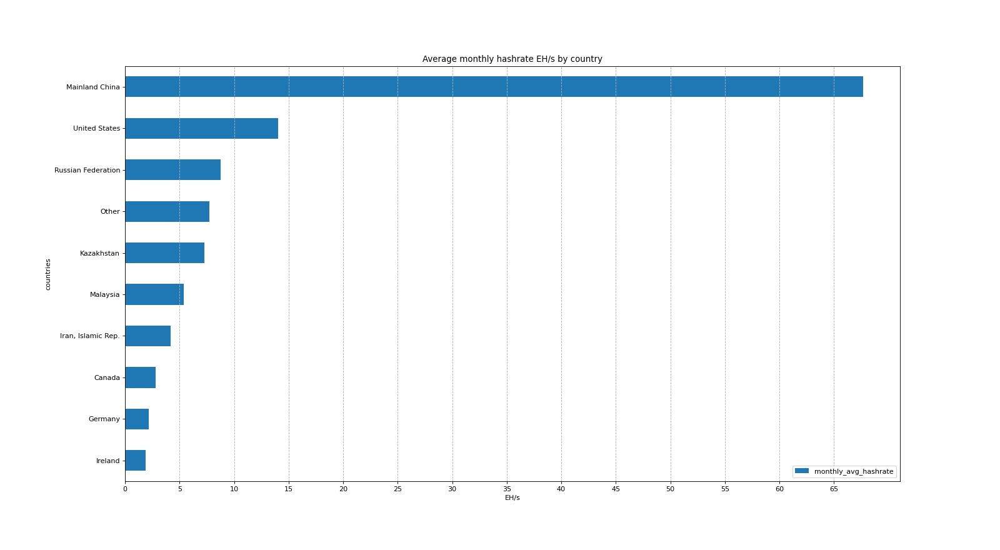
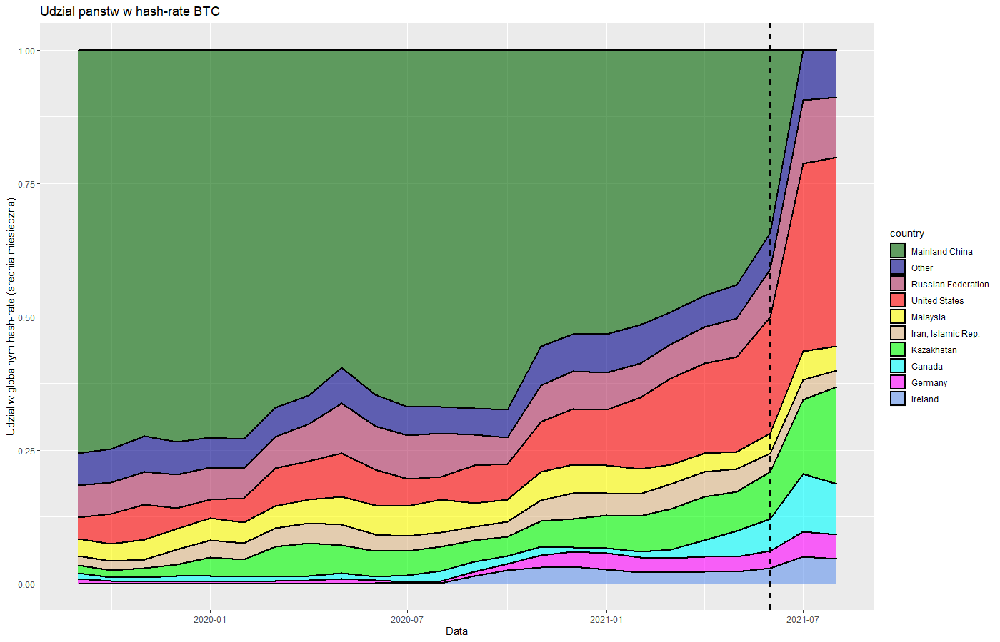

```{r setup, include=FALSE}
knitr::opts_chunk$set(echo = TRUE)
```
# Wstęp

Tematem naszego projektu jest wpływ wydobycia kryptowalut na zanieczyszczenie środowiska i zużycie energii. Korzystamy z danych z następujących źródeł:

<font size="1"> 

* *https://www.blockchain.com/charts/hash-rate*

* *https://ccaf.io/cbeci/mining_map*

* *https://www.statista.com/statistics/263455/primary-energy-consumption-of-selected-countries/*

* *https://ourworldindata.org/emissions-by-sector*

* *https://www.bp.com/en/global/a/energy-economics/statistical-review-of-world-energy.html*

</font>

## Github

Utworzyliśmy wspólne repozytorium, które ułatwia i porządkuje prace nad projektem:

*https://github.com/alexmal01/Data-Visualization-Project-1*

# Wykresy

Od poprzedniej prezentacji ulepszyliśmy i dopracowaliśmy wykresy i wizualizacje:








